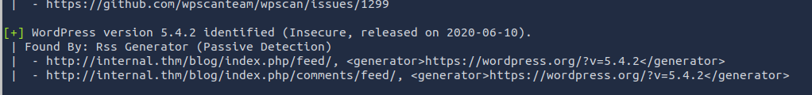
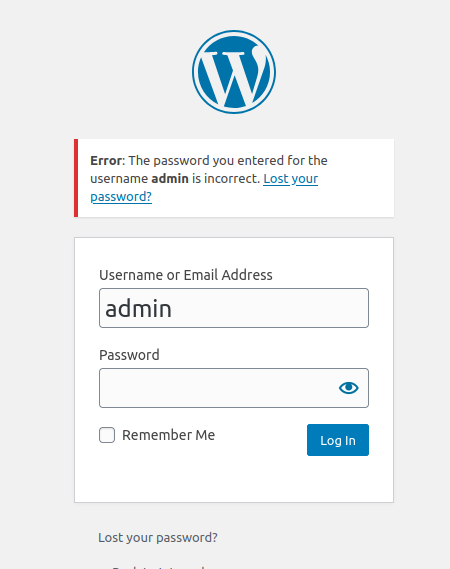
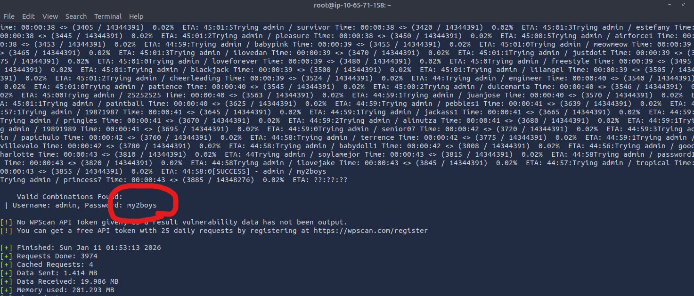
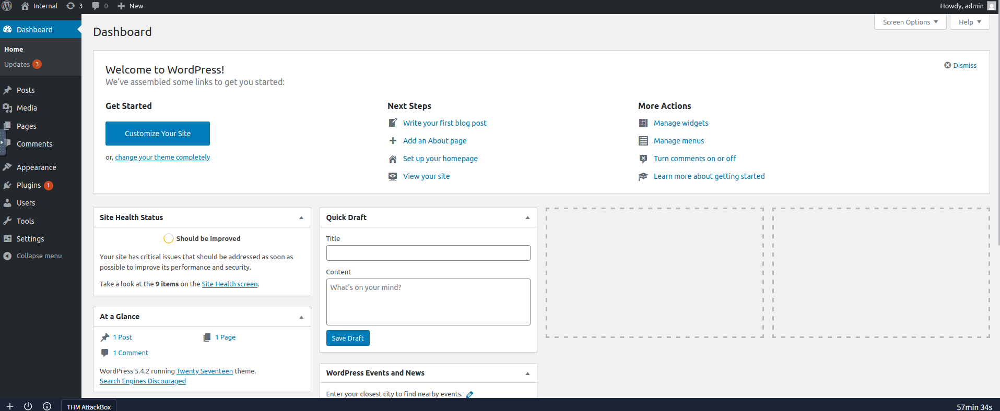
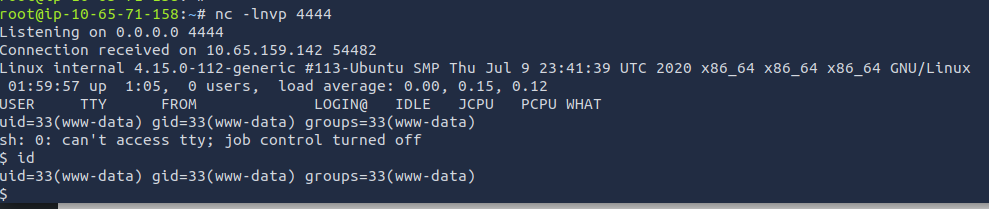
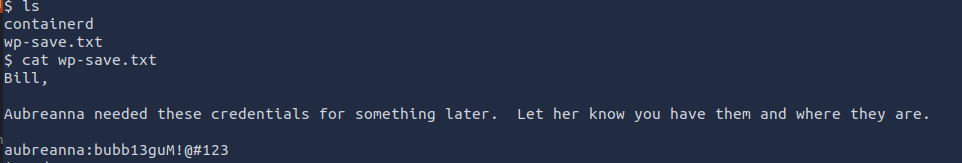
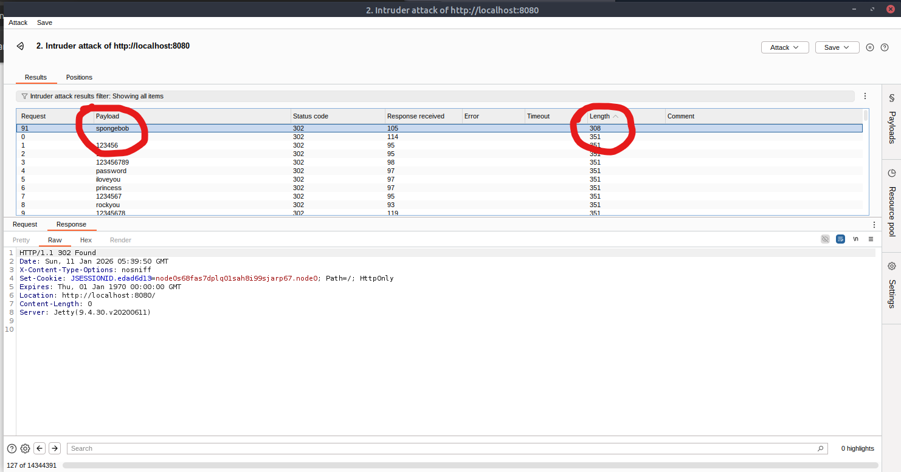
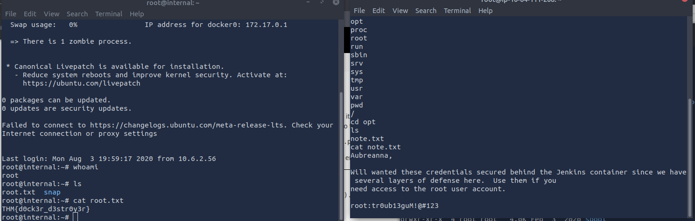

# TryHackMe — Internal Write-up

**Focus:** Web Exploitation, WordPress Attacks, Credential Reuse, Internal Pivoting, Jenkins Abuse  
**Target OS:** Linux  
**Engagement Type:** Black-box Penetration Test (Roleplay)

---

## Executive Summary

This assessment simulated a black-box penetration test against an internal environment scheduled for production release.  
The engagement resulted in **full system compromise**, starting from a publicly exposed WordPress instance and ending with **root access** through credential reuse and internal service abuse.

The attack chain demonstrates how weak credentials, outdated software, and exposed internal services can be chained together to fully compromise an environment.

---


## Reconnaissance

### Service Discovery

An initial **nmap** scan revealed two open TCP ports:

- **22** — SSH  
- **80** — HTTP  

The presence of an HTTP service suggested a web application attack surface.

---

## Web Enumeration

Directory enumeration revealed a WordPress installation.

Further inspection confirmed WordPress by accessing:
```/blog/wp-login.php```

WordPress version enumeration showed:

- **WordPress 5.4.2**



This version is outdated and potentially vulnerable.

---

## WordPress Authentication Attack

Username enumeration confirmed the existence of the user:
```admin```



A password brute-force attack using **WPScan** successfully identified valid credentials:
```admin:my2boys```




---

## WordPress Admin Access

Using the discovered credentials, administrative access to the WordPress dashboard was obtained.



This granted full control over themes and plugin files.

---

## Initial Access

A PHP reverse shell (Pentestmonkey) was uploaded via the **Theme Editor** by modifying `index.php`.

Accessing the main page triggered the payload, resulting in a reverse shell.



---

## Post-Exploitation Enumeration

While enumerating the filesystem, a credential file was discovered:

```/opt/wp-save.txt```


Contents revealed valid system credentials:

```aubreanna:bubb13guM!@#123```




---

## SSH Access (Lateral Movement)

The discovered credentials were reused for SSH access.

```bash
ssh aubreanna@internal.thm
```
The login succeeded.

---

### Internal Enumeration
Inside ```/home/aubreanna```, a file named ```jenkins.txt``` revealed an internal Jenkins service:
```bash
Internal Jenkins service is running on 172.17.0.2:8080
```
SSH port forwarding was configured to access the service locally.

---

### Jenkins Discovery & Access

After forwarding the port, the Jenkins login page became accessible.

Credentials were brute-forced using Burp Suite Intruder, identifying:

```jenkins:spongebob```



---

### Command Execution via Jenkins

With Jenkins access, command execution was achieved using a Groovy reverse shell payload.

A Jenkins job was configured to execute the payload.

This resulted in an elevated shell.

---

### Privilege Escalation

Further enumeration revealed a sensitive file:

```/opt/note.txt```

Contents:
```root:tr0ub13guM!@#123```

Using these credentials, root privileges were obtained.


---

### Conclusion

This engagement highlights how a single weak entry point can cascade into a full system compromise.
The attack chain reflects real-world penetration testing scenarios and reinforces the importance of secure configurations, credential hygiene, and internal service hardening.

**Lab Environment:** TryHackMe VM (Linux), VPN-based isolated network